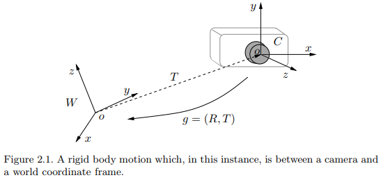
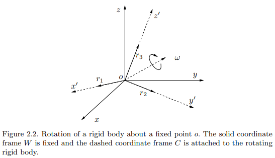

# Representation of a Three-Dimensional Moving Scene

Reference: An Invitation to 3-D vision, Chapter 2. 

## 2.1 Three-dimensional Euclidean space

A point in the Euclidean space

$$ \mathbf{X} \doteq \begin{bmatrix} X_1 \\ X_2 \\ X_3 \end{bmatrix} \in \mathbb{R}^3,   \mathbb{E}^3 $$

A vector in the Euclidean space

$$ v \doteq \mathbf{Y - X} \in \mathbb{R}^3$$

Inner product of two vectors

$$ \left\langle u,v \right\rangle \doteq u^Tv = u_1 v_1 + u_2 v_2 + u_3 v_3, \forall u,v \in \mathbb{R}^3 $$

Cross product of two vectors

$$ u \times v \doteq \begin{bmatrix} u_2v_3 - u_3v_2 \\ u_3v_1 - u_1v_3 \\ u_1v_2 - u_2v_1 \end{bmatrix} \in \mathbb{R}^3  $$

For fixed $ u $, the cross product can be represented by a map from $ \mathbb{R}^3 $  to $ \mathbb{R}^3: u \mapsto u \times v $. We define this mapping matrix by 

$$ \widehat{u} \doteq  \begin{bmatrix} 0 & -u_3 & u_2 \\ u_3 & 0 & -u_1 \\ -u_2 & u_1 & 0 \end{bmatrix} \in \mathbb{R}^3 $$

such that $ u \times v = \widehat{u}v $. Note that $ \widehat{u} $ is a skew-symmetric matrix, i.e. $ \widehat{u}^T = -\widehat{u} $.   

The cross product defines a (one-to-one) map between a vector $ u $ and a 3 x 3 skew-symmetric matrix $ \widehat{u} $. Therefore, the vector space $ \mathbb{R}^3 $ or the space of all skew-symmetric 3 x 3 matrices, called $ so(3) $, are isomorphic (i.e. there exists a one-to-one map that preserves the vector space structure, or an invertible linear transformation). The isomorphism is a *hat-operator*

$$ \and : \mathbb{R}^3 \rightarrow so(3); u \mapsto \widehat{u} $$.

## 2.2 Rigid-body motion

> Rigid-body: the distance between any pair of points $ (p,q) $ on it does not change over time as the object moves.

> Euclidean transformation: a map that preserves the Euclidean distance between every pair of points. The set of all Euclidean transformation in 3-D space is denoted by $ E(3) $.
> $$ g: \mathbb{R}^3 \to \mathbb{R}^3; X \mapsto g(X) $$  

Suppose a vector $ v=\mathbf{Y} - \mathbf{X} $. After the transformation of $g$, we obtain a new vector

$ u = g_*(v) \doteq g(\mathbf{Y}) - g(\mathbf{X}) $ where $ \begin{Vmatrix} g_*(v) \end{Vmatrix} = \begin{Vmatrix} v \end{Vmatrix} ​$.

Some Euclidean transformations are not physically realizable. For example the map

$$ f: \begin{bmatrix} X_1, X_2, X_3 \end{bmatrix} \mapsto \begin{bmatrix} X_1, X_2, -X_3 \end{bmatrix} $$

preserves distances but not **orientations**. (reflection)

> The map or transformation induced by a rigid-body motion is called a *special Euclidean transformation*. The word "*special*" indicates the fact that a transformation is orientation-preserving.

> Rigid-body motion of special Euclidean transformation: A map that preserves the norm and the cross product of any two vectors
>
> 1. norm: $ \begin{Vmatrix} g_*(v) \end{Vmatrix} = \begin{Vmatrix} v \end{Vmatrix}, \forall v \in \mathbb{R}^3 $
> 2. cross product: $ g_*(u) \times g_*(v) = g_*(u \times v), \forall u, v \in \mathbb{R}^3 $
> 3. (consequently) angle or inner product: $ \left\langle u,v \right\rangle = \left\langle g_*(u), g_*(v) \right\rangle $

Let us define a Cartesian coordinate frame, with its principal axes given by three *orthonormal* vectors $ e_1, e_2, e_3 \in \mathbb{R}^3 $ ($e_1 \times e_2 = e_3 $, right-handed frame)

$$ e_i^T e_j = \delta_{ij} \doteq \begin{cases} 1 & \mbox{if } i = j \\ 0 & \mbox{if } i \ne j \end{cases} $$

After a rigid-body motion $ g $,

$$ g_*(e_i)^T g_*(e_j) = \delta_{ij} , \quad g_*(e_1) \times g_*(e_2) = g_*(e_3) $$

The resulting vectors still form a right-handed frame.

When a camera moves, the camera frame also moves along with the camera. The configuration of the camera is then determined by two components:

1. Translational part $ T $ : the vector between the origin of the world frame and that of the camera frame.
2. Rotational part $ R $ : the relative orientation of the camera frame $ C $, with coordinate axes $ (x,y,z) $, relative to the fixed world frame $ W $ with coordinate axes $ (X,Y,Z) $

## 2.3 Rotational motion and its representations

### 2.3.1 Orthogonal matrix representation of rotations

The frame $ C $ relative to the frame $ W $ is determined by the three orthonormal vectors: $ r_1=g_*(e_1), r_2=g_*(e_2), r_3=g_*(e_3) \in \mathbb{R}^3 $. Then the configuration of the rotating object  is determined by the $ 3 \times 3 $ matrix

$$ R_{wc} \doteq \begin{bmatrix} r_1, r_2, r_3 \end{bmatrix} \in \mathbb{R}^3 $$

Since $ r_1, r_2, r_3 $ form an orthonormal frame, 

$$ r_i^T r_j = \delta_{ij} \doteq \begin{cases} 1 & \mbox{if } i = j \\ 0 & \mbox{if } i \ne j \end{cases} $$

$$ R_{wc}^T R_{wc} = R_{wc} R_{wc}^T = I, \quad R_{wc}^{-1} = R_{wc}^T $$  : orthogonal matrix

Since we only deal with a right-handed frame, $ det(R_{wc}) = +1 $. Hence $ R_{wc} $ is a special orthogonal matrix, which is denoted by

> $$ SO(3) \doteq \left\{ R \in \mathbb{R}^{3\times3} \mid R^TR=I, det(R)=+1 \right\} $$

The space $ SO(3) $ is referred as the *special orthogonal group* of $ \mathbb{R}^3 $ or simply *rotation group*.

Suppose that for a given point $ p $, its coordinates in the world frame $ W $ is $ X_w = \left[ X_{1w}, X_{2w}, X_{3w} \right] $.   Since $ r_1, r_2, r_3 $ form a basis for $ \mathbb{R}^3 $, $ X_w $ can also be expressed as  $ X_w = X_{1c}r_1 + X_{2c}r_2 + X_{3c}r_3 $. $ X_c = \left[ X_{1c}, X_{2c}, X_{3c} \right] $  is the coordinates of the same point $ p $ in the frame $ C $ relative to the frame $ W $. 

$$ X_w = X_{1c}r_1 + X_{2c}r_2 + X_{3c}r_3 = R_{wc}X_c $$

$$ X_c = R^{-1}_{wc}X_w = R^T_{wc}X_w $$

$ R_{wc} $ transforms the coordinates $ X_c $ in the frame $ C $ to its coordinates $ X_w $ in frame $ W $

### 2.3.1 Canonical exponential coordinates for rotations

A rotational rigid-body motion in $ \mathbb{E}^3 $ is represented by a $ 3 \times 3 $ matrix $ R \in SO(3) $ but due to the constraint $ R^TR=I $, the dimension of the space of rotation matrices $ SO(3) $. In this subsection, we will introduce an explicit parameterization of rotation matrices.

Given a trajectory $ R(t) $ that describes a continuous rotational motion, the rotation must satisfy 

$$ R(t)^TR(t) = I $$.

By computing the derivative with respect to time $ t $,

$$ \dot{R} R^T(t) + R(t) \dot{R}^T(t) = 0 \quad \Rightarrow  \quad \dot{R}(t) R^T(t) = -(\dot{R}(t) R^T(t))^T $$

The resulting equation shows that $ \dot{R}(t) R^T(t) \in \mathbb{R}^{3 \times 3} $ is a skew-symmetric matrix. There must exist a vector $ w(t) \in \mathbb{R}^3 $ such that 

$$ \dot{R}(t) R^T(t) = \widehat{w}(t) $$

$$ \dot{R}(t) = \widehat{w}(t) R(t) $$

The space of all skew-symmetric matrices is denoted by

> $$ so(3) \doteq \left\{ \widehat{w} \in \mathbb{R}^{3 \times 3} \mid w\in \mathbb{R}^3 \right\} $$.

Note that $ so(3) $ depends only on three parameters.  

Since the above equation is a linear ordinary differential equation (ODE), $ R(t) $ can be interpreted as the state transition matrix. Assuming $ R(0) = I $, the solution is

> $ R(t) = e^{\widehat{w}t} $ where $ e^{\widehat{w}t} $ is the matrix exponential 
>
> $ e^{\widehat{w}t} = I + \widehat{w}t + {(\widehat{w}t)^2 \over 2!} + \cdots + {(\widehat{w}t)^n \over n!} + \cdots $.

The matrix exponential indeed defines a map from the space $ so(3) $ to $ SO(3) $, the so-called *exponential map*

> $$ exp: so(3) \to SO(3); \quad \widehat{w} \mapsto e^{\widehat{w}} $$

We can verify the matrix $ e^{\widehat{w}t} $ is a rotation matrix.

$$ \left( e^{\widehat{w}t} \right)^{-1} = e^{-\widehat{w}t} = e^{\widehat{w}^Tt} = \left( e^{\widehat{w}t} \right)^T $$

Hence $ \left( e^{\widehat{w}t} \right)^T e^{\widehat{w}t} = I $.

> The physical interpretation of $ R(t) = e^{\widehat{w}t} $ is that if $ \begin{Vmatrix} w \end{Vmatrix} = 1 $, $ R(t) = e^{\widehat{w}t} $ is simply a rotation around the axis $ w \in \mathbb{R}^3 $ by an angle $ t $ radians.

> Theorem 2.8 (Logarithm of $ SO(3) $). For any $ R \in SO(3) $, there exists a (not necessarily unique) $ w \in \mathbb{R}^3 $ such that $ R = exp( \widehat{w} ) $. We denote the inverse of the exponential map by $ \widehat{w} = log(R) $.

> Theorem 2.9 (Rodrigues' formula for a rotation matrix). Given $ w \in \mathbb{R}^3$, the matrix exponential $ R = e^{\widehat{w}} $ is given by
>
> >$$ e^{\widehat{w}} = I + {\widehat{w} \over \begin{Vmatrix} w \end{Vmatrix}} sin(\begin{Vmatrix} w \end{Vmatrix}) + {\widehat{w}^2 \over \begin{Vmatrix} w \end{Vmatrix}^2} (1 - cos(\begin{Vmatrix} w \end{Vmatrix}) $$

